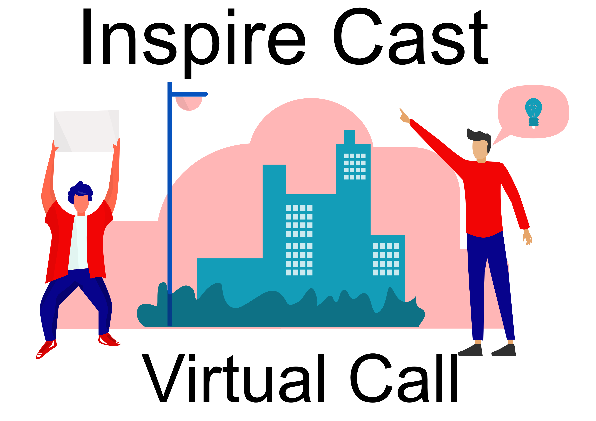

# MSP Virtual Call December 2019
> Applications are currently closed for talks, create an issue/contact me on [Twitter @SalmanMKC](https://twitter.com/salmanmkc "salmanmkc on twitter") if you're not an MSP or contact me on Teams (Salman Chishti)
>**Note**: Not to be confused with the 2020 call in February

## Schedule for the 28th
|Talk Name|Speaker|GMT|IST|Links|
|--|--|--|--|--|
| Introduction | Salman and Sabiha |11:00|16:30|[MSP Program](https://studentpartners.microsoft.com/)|
| MSP Program and Imagine Cup | Salman and Sabiha |11:40|17:10|[Imagine Cup](https://imaginecup.microsoft.com/en-us/Events?id=0)|
| Visual Studio Code and Open Source | Syed Farhan Ahmad |12:20|17:50|[VS Code](https://code.visualstudio.com/)|
|How to set up your own community and inspire others | CH Hanzaila |13:00|18:30||
| C#, object orientation and Xamarin | Dhia Snoussi |13:40|19:10|[C#](https://docs.microsoft.com/en-us/dotnet/csharp/) [Xamarin](https://dotnet.microsoft.com/apps/xamarin)|
| Introduction to cyber security | Simran Makhija |14:20|19:50||
| Theory of Machine Learning | Vedant Bahel |13:40|19:10||
|VR - Getting Started with development and mythbusters|Sukhman Sukhman Preet Singh Jawa|15:40|21:10|
|Collboration with Live Share|Ganesh Tiwawi|16:20|21:50|[Visual Studio Online](https://visualstudio.microsoft.com/services/visual-studio-online/)|
|Image Classification and Object Detection using Microsoft Azure|Sundereshwar|17:05|22:35|[Azure Computer Vision](https://azure.microsoft.com/en-gb/services/cognitive-services/computer-vision/)|
|Creating reusable web components with .net (blazor)|Gomolemo Mohapi|17:45|23:15|[Blazor](https://dotnet.microsoft.com/apps/aspnet/web-apps/blazor)|
|Using Xamarin Forms to create mobile apps|Dan Kyungu|18:25|23:55|[Xamarin Forms](https://dotnet.microsoft.com/apps/xamarin/xamarin-forms)|
|Introduction to power platform|Damilola Omiyera|19:05|0:35|[Power Platform](https://powerplatform.microsoft.com/en-gb/)|
|Power Automate: Getting started|Mohamed Sahbi|19:45|1:15|[Power Automate](https://flow.microsoft.com/en-us/)|
|Deploying a virtual machine on Microsoft Azure|Eric Yu|20:25|1:55|[Azure Virtual Machines](https://azure.microsoft.com/en-gb/services/virtual-machines/)|

A call led by MSP Inspire, our initiative is to grow and expand the awareness of the MSP program. We are aiming to encorporate as many MSPs to talk as possible, as well as industry experts, MVPs, and reseachers. Right now we are in the planning stages, so if you would like to get involved drop an email: 13schishti@gmail.com

## The aims of this call

- **To make learning accessible to everyone:** As students we are continously learning and growing, we aim to  grow the reach of lectuers and spread the knowledge to make it accessible wherever you are.
- **Build a network:** We hope to build a strong network and keep as many of you tightly-knit within this community to continue do good for others.
- **Exposure to other fields:** Universities will cover certain aspects within a subject, however not all aspects or modules are shown. This would be a good way to give viewers an introduction into many fields.
- **Less pressure:** We know that universities will have deadlines and shape their courses around exams, but having the chance to show people things that you yourself are passionate about comes much easier, and with less pressure.

## Links

[Microsoft Student Partners]([https://studentpartners.microsoft.com](https://studentpartners.microsoft.com/))  
[UCL Data Science Hackathon w/ Microsoft and Amex]([https://www.youtube.com/watch?v=9lvn1BWlpGg](https://www.youtube.com/watch?v=9lvn1BWlpGg))  
[Imagine Cup 2020 Trailer]([https://www.youtube.com/watch?v=Z7mQ0KIVvhY&t=1s](https://www.youtube.com/watch?v=Z7mQ0KIVvhY&t=1s))  

## Organisers

<table>
  <tr>
    <td align="center"><a href="https://www.linkedin.com/in/SalmanMKC"> <sub<b>SalmanMKC</b></a> 
    <td align="center"><a href="https://www.linkedin.com/in/dawoodiddris/"> <sub<b>Dawuda</b></a> 
    <td align="center"><a href="https://www.linkedin.com/in/sabiha-shaik/"> <sub<b>Sabiha</b></a> 
  </tr>
</table>

