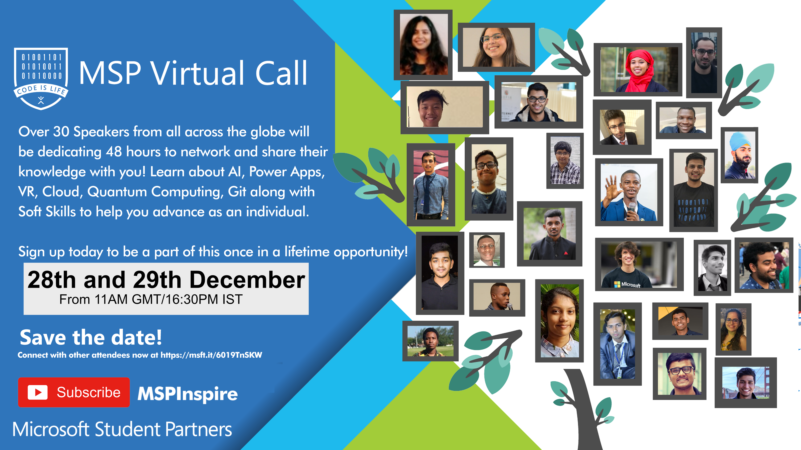

# MSP Virtual Call December 28th and 29th 2019
> Applications are currently closed for talks, create an issue/contact me on [Twitter @SalmanMKC](https://twitter.com/salmanmkc "salmanmkc on twitter") if you're not an MSP or contact me on Teams (Salman Chishti)
>**Note**: Not to be confused with the 2020 call in February

Stream will take place here: [YouTube Channel](https://www.youtube.com/channel/UCokbgC90PVz7jrAK3FN-uSA)
Come join our community here: https://msft.it/6019TnSKW

## Schedule for the 28th
|Talk Name|Speaker(s)|GMT|IST|Links|
|--|--|--|--|--|
| Introduction | Salman Chishti and Sabiha Shaik |11:00|16:30|[MSP Program](https://studentpartners.microsoft.com/)|
| How the MSP Program helped me | Yashraj Nayak|11:40|17:10|[Imagine Cup](https://imaginecup.microsoft.com/en-us/Events?id=0)|
| Version Control Systems and Open Source | Syed Farhan Ahmad |12:20|17:50|[Version Control Systems](https://git-scm.com/book/en/v2/Getting-Started-About-Version-Control)|
|How to set up your own community and inspire others | CH Hanzaila |13:00|18:30|[CH's MSP Group](https://www.facebook.com/MSP.PAK/)|
| C#, object orientation and Xamarin | Dhia Snoussi |13:40|19:10|[C#](https://docs.microsoft.com/en-us/dotnet/csharp/) [Xamarin](https://dotnet.microsoft.com/apps/xamarin)|
| Introduction to Power Bi | Ayan Keynan |[Power Bi](https://powerbi.microsoft.com/en-us/)|
| Theory of Machine Learning | Vedant Bahel |13:40|19:10||
|VR - Getting Started with development and mythbusters|Sukhman Sukhman Preet Singh Jawa|15:40|21:10|
|Collaboration with Live Share|Ganesh Tiwari|16:20|21:50|[Visual Studio Online](https://visualstudio.microsoft.com/services/visual-studio-online/)|
|Image Classification and Object Detection using Microsoft Azure|Sundereshwar Kodi|17:05|22:35|[Azure Computer Vision](https://azure.microsoft.com/en-gb/services/cognitive-services/computer-vision/)|
Algorithm Building/Hack the Technical Interview|Victoria Carolline Correa Andrade||
|Using Xamarin Forms to create mobile apps|Dan Kyungu|18:25|23:55|[Xamarin Forms](https://dotnet.microsoft.com/apps/xamarin/xamarin-forms)|
|Introduction to Power Platform|Damilola Omiyera|14:20|19:50|19:05|0:35|[Power Platform](https://powerplatform.microsoft.com/en-gb/)|
|Power Automate: Getting started|Mohamed Sahbi|19:45|1:15|[Power Automate](https://flow.microsoft.com/en-us/)|
|Deploying a virtual machine on Microsoft Azure|Eric Yu|20:25|1:55|[Azure Virtual Machines](https://azure.microsoft.com/en-gb/services/virtual-machines/)|

## Schedule for the 29th
|Talk Name|Speaker(s)|GMT|IST|Links|
|--|--|--|--|--|
| Introduction | Salman Chishti and Sabiha Shaik |11:00|16:30|[MSP Program](https://studentpartners.microsoft.com/)|
| Rock your first job as a junior developer | Mohamed Sahbi|11:40|17:10||
| Azure cognitive service, custom vision | Damilola Omiyera|12:20|17:50|[Azure Computer Vision](https://azure.microsoft.com/en-gb/services/cognitive-services/computer-vision/)|
|How to build a chatbot using RASA | Prasad Deshmukh |13:00|18:30||
| C#, object orientation and Xamarin | Naveen Lakhchaura |13:40|19:10|[C#](https://docs.microsoft.com/en-us/dotnet/csharp/) [Xamarin](https://dotnet.microsoft.com/apps/xamarin)|
| An Introduction to Quantum Computing | Syed Farhan Ahmad |14:20|19:50|[Microsoft Quantum](https://www.microsoft.com/en-in/quantum/)|
| What you can do apart from attending lectures | Dawuda Iddrisu and Prashanth Konda|15:10|20:40||
|Asp.net MVC|Dhruv Kinger|15:40|21:10||
|Creating reusable web components with .net (blazor)|Gomolemo Mohapi|17:45|23:15|[Blazor](https://dotnet.microsoft.com/apps/aspnet/web-apps/blazor)|
|Build Deep Learning Models using Azure and Keras|Vijaya Gajanan Buddhavarapu|16:50|22:20|[Azure Machine Learning](https://azure.microsoft.com/en-gb/services/machine-learning/)|
|Getting into Research|Vedant Bahel|17:50|23:20||
|Hacks for Studentpreneur|Antony Diaz|18:30|00:00|[Xamarin Forms](https://dotnet.microsoft.com/apps/xamarin/xamarin-forms)|
|Building Chatbots for Enterprise Solution|Olumide Ogundare|19:10|0:40|[Microsoft QnA Maker](https://azure.microsoft.com/en-gb/services/cognitive-services/qna-maker/)|
|Deploying a web app on Azure App Service|Shreya Prasad|19:40|1:10|[Azure App Service](https://azure.microsoft.com/en-gb/sebalrvices/app-service/)|
|Hacking Web Literacy|Ekansh Gupta|20:20|1:50||
|A guide to a successful path in Software Development|Salman Chishti and Sabiha Shaik|21:00|2:30||

A call led by MSP Inspire, our initiative is to grow and expand the awareness of the MSP program. We are aiming to encorporate as many MSPs to talk as possible, as well as industry experts, MVPs, and reseachers. Right now we are in the planning stages, so if you would like to get involved drop an email: 13schishti@gmail.com

## The aims of this call

- **To make learning accessible to everyone:** As students we are continously learning and growing, we aim to  grow the reach of lectuers and spread the knowledge to make it accessible wherever you are.
- **Build a network:** We hope to build a strong network and keep as many of you tightly-knit within this community to continue do good for others.
- **Exposure to other fields:** Universities will cover certain aspects within a subject, however not all aspects or modules are shown. This would be a good way to give viewers an introduction into many fields.
- **Less pressure:** We know that universities will have deadlines and shape their courses around exams, but having the chance to show people things that you yourself are passionate about comes much easier, and with less pressure.

## Videos

## Organisers

<table>
  <tr>
    <td align="center"><a href="https://www.linkedin.com/in/SalmanMKC"> <sub<b>Salman Chishti</b></a> 
    <td align="center"><a href="https://www.linkedin.com/in/dawoodiddris/"> <sub<b>Dawuda Iddrisu</b></a> 
    <td align="center"><a href="https://www.linkedin.com/in/sabiha-shaik/"> <sub<b>Sabiha Shaik</b></a> 
  </tr>
</table>

